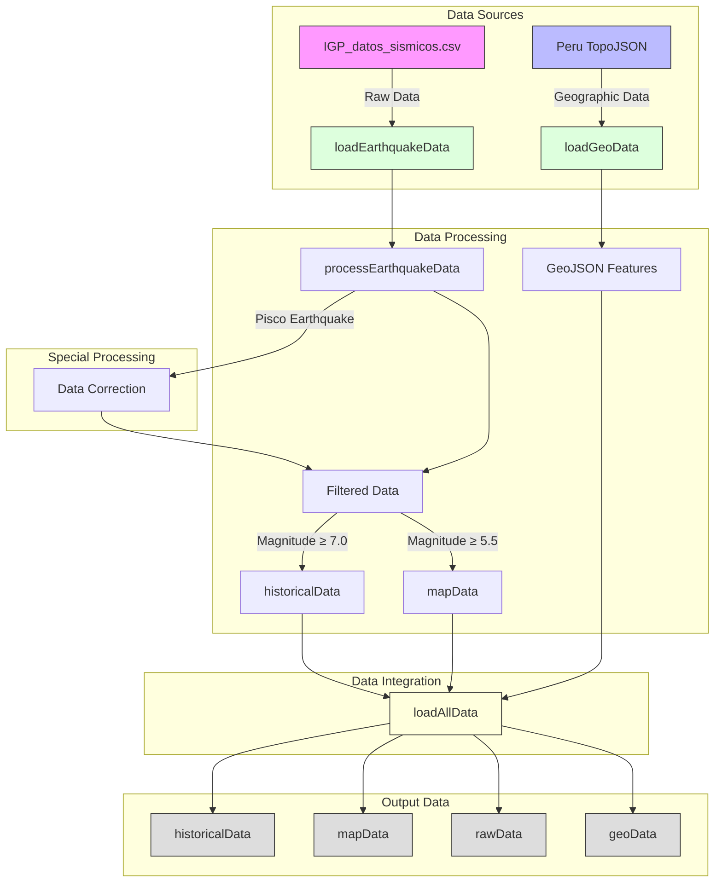

```mermaid
graph TD
    subgraph Data Sources
        A[IGP_datos_sismicos.csv] -->|Raw Data| B[loadEarthquakeData]
        T[Peru TopoJSON] -->|Geographic Data| G[loadGeoData]
    end

    subgraph Data Processing
        B --> C[processEarthquakeData]
        C --> D[Filtered Data]
        D -->|Magnitude ≥ 5.5| E[mapData]
        D -->|Magnitude ≥ 7.0| F[historicalData]
        G --> H[GeoJSON Features]
    end

    subgraph Data Integration
        E --> I[loadAllData]
        F --> I
        H --> I
    end

    subgraph Special Processing
        C -->|Pisco Earthquake| J[Data Correction]
        J --> D
    end

    subgraph Output Data
        I --> K[geoData]
        I --> L[rawData]
        I --> M[mapData]
        I --> N[historicalData]
    end

    style A fill:#f9f,stroke:#333
    style T fill:#bbf,stroke:#333
    style B fill:#dfd,stroke:#333
    style G fill:#dfd,stroke:#333
    style I fill:#ffd,stroke:#333
    style K fill:#ddd,stroke:#333
    style L fill:#ddd,stroke:#333
    style M fill:#ddd,stroke:#333
    style N fill:#ddd,stroke:#333
```